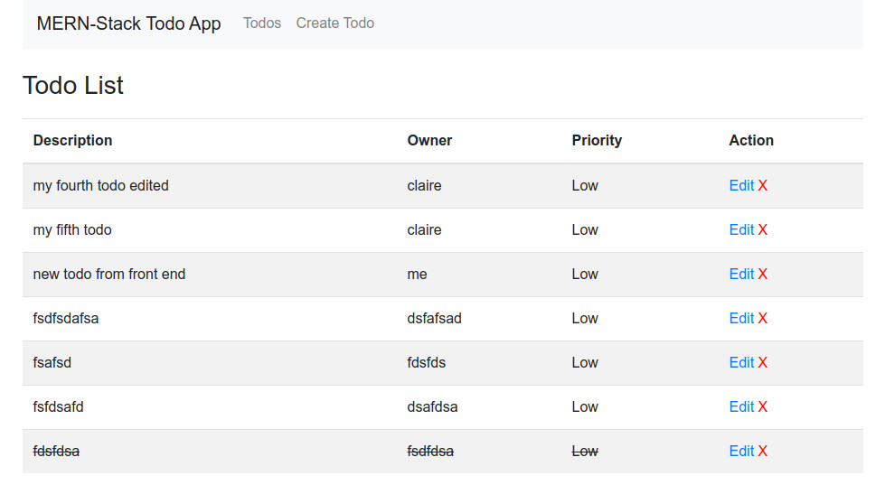

Client for a localhost-run, MERN stack todo app

Follow instructions for setting up backend here first: https://github.com/clairefro/mern-todo-app-backend

### Install
`yarn install`

`yarn start`

client runs on localhost:3000

